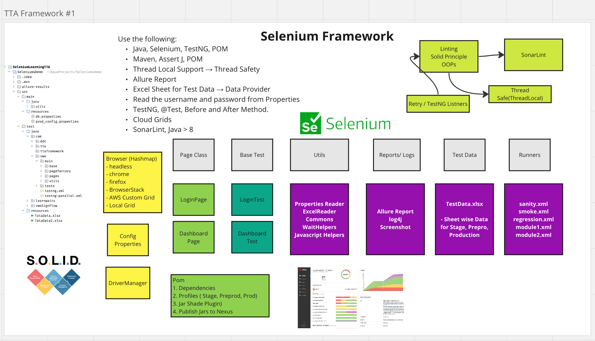
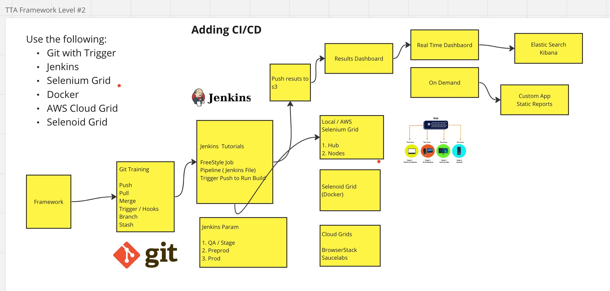

# 🚀 Advanced Selenium Automation Framework (Java)

**Author - Mayank Paliwal**

---

## 📌 Overview

This is a robust, scalable, and maintainable Selenium automation framework built using Java, TestNG, and Maven.

It supports parallel execution, thread safety, reporting, and data-driven testing. The framework is designed to run both locally and on cloud/grid environments like Selenoid (Docker).

---

## 🧰 Tech Stack

* Java (8+)
* Selenium WebDriver
* TestNG
* Maven
* AssertJ
* Log4j
* Allure Report
* Apache POI (Excel)
* Page Object Model (POM)
* WebDriverManager
* POM (Page Object Model)/Page Factory 
* ThreadLocal (Thread Safety)

---

## ⚙️ Key Features

* Page Object Model (POM)
* ThreadLocal WebDriver (Thread-safe execution)
* Parallel execution using TestNG
* Excel-based test data using DataProvider
* Config-based username & password handling
* Logging using Log4j
* Allure reporting with screenshots
* Retry mechanism using TestNG listeners
* Run on local and Selenoid (Docker Grid)
* Code quality using SonarLint

---



---

## 🏗️ Framework Architecture

### Main Components

* **Pages**

  * LoginPage
  * DashboardPage

* **Tests**

  * LoginTest
  * DashboardTest

* **Base**

  * Driver setup
  * ThreadLocal management

* **Utils**

  * Wait helpers
  * JavaScript helpers
  * Excel reader
  * Properties reader

* **Test Data**

  * Excel sheets (Stage / PreProd / Prod)

* **Reports & Logs**

  * Allure Reports
  * Screenshots
  * Log4j logs

* **Runners**

  * sanity.xml
  * smoke.xml
  * regression.xml

---

## ▶️ Test Execution

Run all tests:

```bash
mvn clean test
```

Run specific suite:

```bash
mvn test -Dsurefire.suiteXmlFiles=testng.xml



```

---

## 🧵 Parallel Execution

* Configured via TestNG XML
* Uses ThreadLocal WebDriver
* Supports:

  * Method-level execution
  * Class-level execution

---

## 📁 Project Structure

```
src
 ├── main
 │   ├── java
 │   │   ├── base
 │   │   ├── pages
 │   │   ├── utils
 │   │   └── factory
 │   └── resources
 │       ├── config.properties
 │       └── log4j.properties
 │
 ├── test
 │   ├── java
 │   │   ├── tests
 │   │   └── listeners
 │   └── resources
 │       ├── testng.xml
 │       └── testdata.xlsx
```

---

## 🔄 Data-Driven Testing

* Excel handled using Apache POI
* Integrated with TestNG `@DataProvider`
* Supports multiple environments and sheets

---

## 🔁 Retry Mechanism

* Implemented using TestNG Listeners
* Automatically retries failed tests

---

## 📸 Reporting

Generate Allure report:

```bash
allure serve allure-results
```

Includes:

* Step-level details
* Screenshots on failure
* Execution summary

---

## 🌐 Execution Support

* Local execution
* Selenoid (Docker Grid)
* Cloud execution supported

---

## 🐳 Selenoid - Docker Grid

* Runs tests inside Docker containers
* Helps scale execution
* Faster and isolated test runs

---

## 🧱 Design Principles

* SOLID principles
* DRY (Don’t Repeat Yourself)
* Reusable utilities
* Clean and maintainable code

---

## 🌍 Browser Support

* Chrome
* Firefox
* Headless mode
* Remote Grid

---

## 🚀 Future Enhancements

* CI/CD integration (Jenkins, GitHub Actions)
* Docker-based execution setup
* API + UI hybrid framework
* Advanced reporting improvements

---
